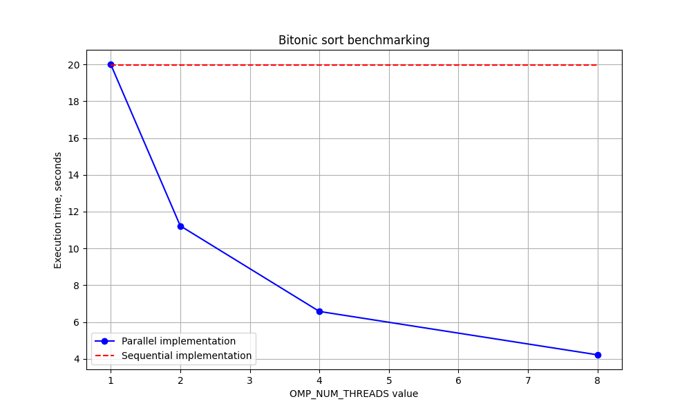

# nsu_parallel-programming
Project for MMF NSU Master's course "Parallel Programming"

## Bitonic sort

There is sequential implementation of Bitonic sort algorithm.
Program reads an array of integers from the file provided as argument, and writes sorted array to another file.

Technical

### Usage example
```
> main-seq.exe tests\test3.txt 
Reading file tests\test3.txt
Elapsed time: 0.01000 seconds
Writing result array to tests\test3.txt.result
```

### Build

```
gcc -O3 -o main-seq -fopenmp .\bitonic_sort_sequential.c .\main.c .\util.c
gcc -O3 -o main-parallel -fopenmp .\bitonic_sort_parallel.c .\main.c .\util.c
```

### Benchmarking

For performance measurements the file with 2^26 elements were generated:
```
nsu_parallel-programming\tests> python test_generator.py 26 bench.txt
```

Results of benchmarking:


### Test stand configuration

|  |  |
|---|---|
| OS | Windows 11 |
| processor | 12th Gen Intel(R) Core(TM) i5-12400F, 2500 MHz|
|cores | 6 |
|logical processors | 12 |

